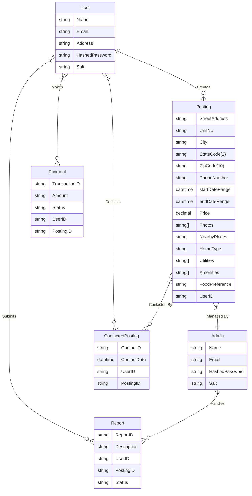

# Object Model

## Model for the application

```mermaid
erDiagram
    User {
        string Name
        string Email
        string Address
        string HashedPassword
        string Salt
    }
    Posting {
        string StreetAddress
        string UnitNo
        string City
        string StateCode(2)  
        string ZipCode(10)   
        string PhoneNumber      
        datetime startDateRange
        datetime endDateRange   
        decimal Price        
        string[] Photos     
        string NearbyPlaces  
        string HomeType      
        string[] Utilities   
        string[] Amenities   
        string FoodPreference 
        string UserID        
    }
    Admin {
        string Name
        string Email
        string HashedPassword
        string Salt
    }
    Payment {
        string TransactionID
        string Amount
        string Status
        string UserID
        string PostingID
    }
    Report {
        string ReportID
        string Description
        string UserID
        string PostingID
        string Status
    }
    ContactedPosting {
        string ContactID
        datetime ContactDate
        string UserID
        string PostingID
    }
    User ||--o{ Posting : "Creates"
    Posting }|--|| Admin : "Managed By"
    User }|--o{ Payment : "Makes"
    User }|--o{ Report : "Submits"
    Admin }|--o{ Report : "Handles"
    User }|--o{ ContactedPosting : "Contacts"
    Posting }|--o{ ContactedPosting : "Contacted By"


```